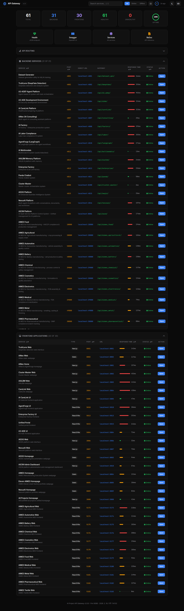
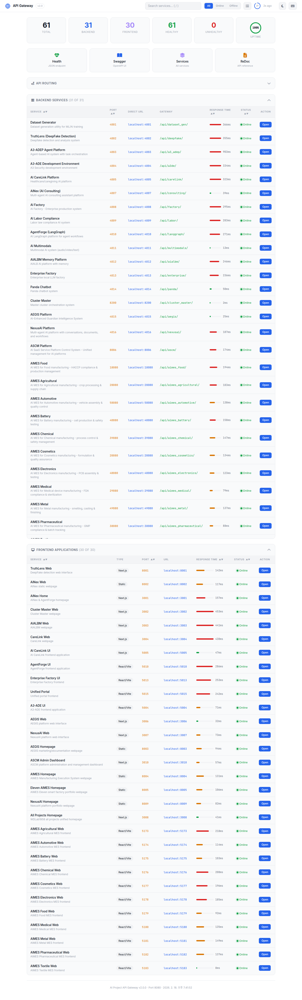
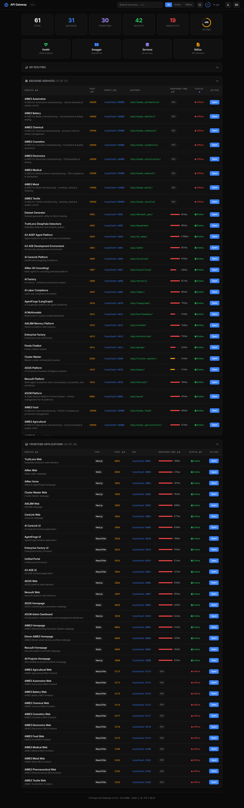
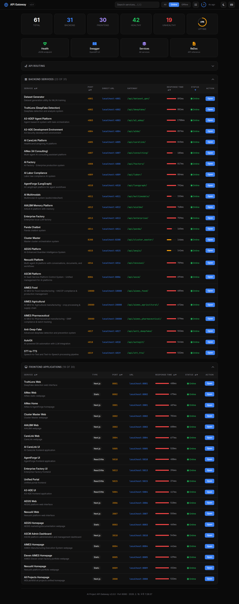
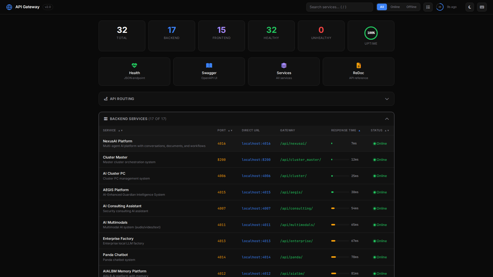
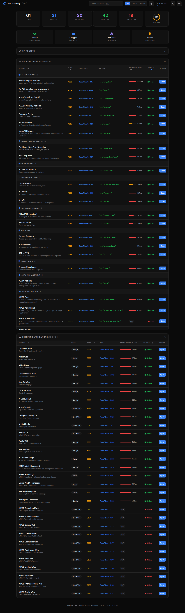
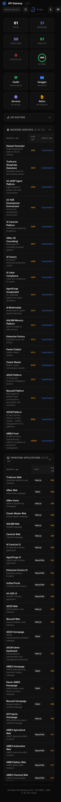
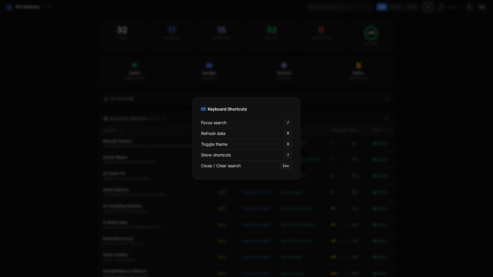

# AI Project API Gateway

> 61개 마이크로서비스(Backend 30 + Frontend 30 + Gateway 1)를 단일 엔드포인트로 통합 관리하는 API Gateway

**Version:** 2.0.0
**Port:** 8080
**Author:** Brian Lee
**Last Update:** Feb. 18, 2026



---

## 목차

- [개요](#개요)
- [아키텍처](#아키텍처)
- [빠른 시작](#빠른-시작)
- [디렉토리 구조](#디렉토리-구조)
- [파일 설명](#파일-설명)
  - [Python 스크립트](#python-스크립트)
  - [Shell 스크립트](#shell-스크립트)
  - [기타 파일](#기타-파일)
- [서비스 목록](#서비스-목록)
  - [Backend Services](#backend-services)
  - [Frontend Services](#frontend-services)
- [API 엔드포인트](#api-엔드포인트)
- [대시보드](#대시보드)
- [로그](#로그)
- [트러블슈팅](#트러블슈팅)
- [기술 스택](#기술-스택)

---

## 개요

AI Project API Gateway는 다수의 AI/ML 마이크로서비스를 하나의 진입점(`:8080`)으로 묶어 주는 리버스 프록시 겸 관리 대시보드이다.

주요 기능:

- **리버스 프록시** - `/api/{service}/{path}` 패턴으로 모든 백엔드 서비스에 요청 전달
- **헬스 체크** - 전체 서비스의 상태를 비동기로 병렬 점검
- **웹 대시보드** - 실시간 서비스 상태, 응답시간, 검색/필터, 다크/라이트 테마 지원
- **OpenAPI 문서** - Swagger UI(`/swagger`) 및 ReDoc(`/redoc`) 자동 생성
- **서비스 관리 스크립트** - 전체 서비스 일괄 시작/중지/상태 확인

---

## 아키텍처

```
                         ┌─────────────────────┐
                         │   Web Dashboard      │
                         │   localhost:8080      │
                         └────────┬─────────────┘
                                  │
                    ┌─────────────┴──────────────┐
                    │    API Gateway (FastAPI)     │
                    │    Reverse Proxy + Health    │
                    └─────────────┬──────────────┘
                                  │
              ┌───────────────────┼───────────────────┐
              │                   │                    │
     ┌────────┴────────┐ ┌───────┴───────┐  ┌────────┴────────┐
     │  Backend (31)   │ │ Frontend (30) │  │   Static Sites  │
     │  :4001 - :4019  │ │ :3001 - :5183 │  │   :8001 - :8009 │
     │  :8200,:18-58K  │ │               │  │                 │
     └─────────────────┘ └───────────────┘  └─────────────────┘
```

---

## 빠른 시작

```bash
# Gateway만 시작
./start_gateway.sh

# 전체 서비스(61개) + Gateway 시작
./start_all_services.sh

# 서비스 상태 확인
./status_services.sh

# 전체 서비스 중지
./stop_all_services.sh
```

시작 후 접속:

| 항목 | URL |
|------|-----|
| 대시보드 | <http://localhost:8080> |
| 헬스 체크 | <http://localhost:8080/health> |
| Swagger UI | <http://localhost:8080/swagger> |
| ReDoc | <http://localhost:8080/redoc> |
| 서비스 목록 (JSON) | <http://localhost:8080/services> |
| API 문서 | <http://localhost:8080/docs/api> |

---

## 디렉토리 구조

```
API_Gateway/
├── api_gateway_v2.py        # 메인 게이트웨이 애플리케이션 (v2.0)
├── api_gateway.py           # 레거시 게이트웨이 (v1.0, 보관용)
├── start_gateway.sh         # Gateway 단독 시작 스크립트
├── start_all_services.sh    # 전체 서비스 일괄 시작 스크립트
├── stop_all_services.sh     # 전체 서비스 일괄 중지 스크립트
├── status_services.sh       # 서비스 상태 확인 스크립트
├── SERVICE_STATUS.md        # 서비스 레지스트리 문서
├── favicon.ico              # 브라우저 탭 아이콘
├── README.md                # 이 문서
└── __pycache__/             # Python 바이트코드 캐시 (자동 생성)
```

---

## 파일 설명

### Python 스크립트

#### `api_gateway_v2.py` (메인 애플리케이션)

현재 사용 중인 API Gateway v2.0. FastAPI 기반의 비동기 웹 애플리케이션이다.

**구성 요소:**

| 섹션 | 설명 |
|------|------|
| `BACKEND_SERVICES` | 31개 백엔드 서비스 정의 (이름, 포트, 경로, 진입점) |
| `FRONTEND_SERVICES` | 30개 프론트엔드 서비스 정의 (이름, 포트, 타입) |
| `API_DOCS` | 주요 서비스별 API 엔드포인트 문서 (deepfake, carelink, aimes_food 등 20개) |
| `SERVICE_CATEGORIES` | 서비스 카테고리 분류 (AI Platforms, Detection, Healthcare 등 9개 그룹) |
| `check_service_health()` | 개별 서비스 헬스 체크 (`/health`, `/api/health`, `/`, `/api/` 순서로 시도) |
| `check_all_services()` | 전체 서비스 병렬 헬스 체크 (`asyncio.gather`) |
| `DASHBOARD_HTML` | 웹 대시보드 HTML/CSS/JS 전체 (인라인 SPA) |
| `root()` | 대시보드 렌더링 - 서비스 데이터를 JSON으로 HTML에 주입 |
| `proxy_request()` | `/api/{service}/{path}` 리버스 프록시 - 모든 HTTP 메서드 지원 |

**대시보드 기능:**

- 다크/라이트 테마 토글 (`localStorage` 저장)
- 서비스 검색/필터 (이름, 설명, 포트 매칭, 150ms 디바운스)
- 상태 필터 (All/Online/Offline 버튼)
- 테이블 정렬 (Service, Port, Response Time, Status 컬럼)
- 서비스 상세 패널 (행 클릭 시 API 문서 확장)
- 카테고리 그룹 뷰 (플랫/그룹 토글)
- 응답시간 시각화 (색상 바 + 스파크라인 히스토리)
- 상태 변경 토스트 알림 (Online/Offline 전환 감지)
- Fetch 에러 배너 (데이터 수집 실패 시)
- Offline 서비스 N/A 배지
- 모바일 반응형 (768px/480px 브레이크포인트)
- 키보드 단축키 (`/`, `R`, `D`, `?`, `Esc`)
- 행 수 표시 `(N of M)` 형식
- **Open 버튼** - 각 서비스 행의 Action 컬럼에서 클릭 시 해당 서비스를 새 브라우저 탭으로 열기
- 30초 자동 새로고침 카운트다운 (SVG 원형 프로그레스)
- Uptime 퍼센트 SVG 링
- 접이식 섹션 (`localStorage` 상태 저장)
- 스켈레톤 로딩 애니메이션

**실행:**

```bash
python3 api_gateway_v2.py
# 또는
uvicorn api_gateway_v2:app --host 0.0.0.0 --port 8080
```

---

#### `api_gateway.py` (레거시 v1.0)

v1.0 게이트웨이. v2.0으로 대체되어 더 이상 사용하지 않으나 참고용으로 보관 중이다.

**v1.0 vs v2.0 차이점:**

| 항목 | v1.0 | v2.0 |
|------|------|------|
| 대시보드 | JSON 응답 | 풀 웹 UI (HTML/CSS/JS) |
| 헬스 체크 | 순차 실행 | 비동기 병렬 실행 (`asyncio.gather`) |
| 응답시간 | 미측정 | ms 단위 측정 |
| 프론트엔드 서비스 수 | 15개 (일부 미확인 포트) | 15개 (실제 운영 서비스) |
| OpenAPI 문서 | 기본 | Swagger + ReDoc + 서비스별 문서 |
| favicon | 미지원 | 지원 |

---

### Shell 스크립트

#### `start_gateway.sh` - Gateway 단독 시작

API Gateway만 시작하는 스크립트. 백엔드/프론트엔드 서비스는 시작하지 않는다.

**동작 순서:**

1. 기존 Gateway 프로세스 중복 실행 여부 확인
2. Python 의존성 검사 및 자동 설치 (`fastapi`, `httpx`, `uvicorn[standard]`)
3. `nohup`으로 백그라운드 실행
4. 프로세스 기동 확인 후 URL/PID 정보 출력

**로그 위치:** `/tmp/api_gateway.log`

```bash
./start_gateway.sh
# 중지: pkill -f api_gateway_v2.py
```

---

#### `start_all_services.sh` - 전체 서비스 일괄 시작

61개 서비스(Backend 30 + Frontend 30 + Gateway 1)를 순차적으로 시작한다.

**동작 순서:**

1. 각 서비스의 포트 사용 여부 확인 (이미 사용 중이면 SKIP)
2. 서비스별 작업 디렉토리로 이동 후 `nohup`으로 백그라운드 실행
3. PID 확인으로 기동 성공/실패 판정
4. 전체 시작 후 5초 대기, Gateway 헬스 체크로 최종 확인

**서비스별 실행 방식:**

| 유형 | 서비스 | 실행 명령 |
|------|--------|-----------|
| Streamlit | dataset_gen | `streamlit run main.py --server.port 4001` |
| Uvicorn | deepfake, a3de, carelink 등 13개 | `uvicorn {module}:app --host 0.0.0.0 --port {port}` |
| Flask-SocketIO | multimodals | `python -c "import app; socketio.run(...)"`|
| Docker | aimes_food | `docker compose up -d` |
| Node.js | aimes_agricultural 등 10개 AIMES GW | `env PORT={port} node src/index.js` |
| Python HTTP | truthlens, webpage_ainex 등 5개 | `python3 -m http.server {port}` |
| Next.js | ainex_home, cluster_master_web 등 8개 | `npx next dev -p {port}` |
| Vite | langgraph_frontend 등 4개 + AIMES 11개 | `npx vite --port {port} --host` |

**출력 예시:**

```
  [OK]   deepfake (port 4002, PID 12345)
  [SKIP] cluster (port 4006 already in use)
  [FAIL] panda (port 4014) - check /tmp/panda.log
```

**로그 위치:** `/tmp/{service_name}.log`

---

#### `stop_all_services.sh` - 전체 서비스 일괄 중지

모든 관련 프로세스를 타입별로 종료한다.

**종료 대상 (순서):**

1. Streamlit 서버 (`pkill -f "streamlit run"`)
2. Python HTTP 서버 (`pkill -f "python3 -m http.server"`)
3. Uvicorn 서버 (`pkill -f "uvicorn"`)
4. Flask-SocketIO (`pkill -f "import app as a"`)
5. Node.js 개발 서버 (`npm run dev`, `next dev`, `next-server`, `vite`)
6. API Gateway (`pkill -f "api_gateway_v2"`)

종료 후 61개 포트를 순회하며 아직 사용 중인 포트가 있는지 확인하고 경고를 출력한다.

---

#### `status_services.sh` - 서비스 상태 확인

61개 서비스의 실행 상태를 포트 기반으로 확인하고 색상 표시한다.

**동작:**

1. `ss -tlnp`로 각 서비스 포트 리스닝 여부 확인
2. Backend(31) / Frontend(30) / Gateway(1) 섹션별 표시
3. UP(초록) / DOWN(빨강) 색상 구분
4. Gateway `/health` API 호출로 실제 헬스 체크 결과 비교
5. Unhealthy 서비스 목록 별도 표시

**출력 예시:**

```
[Backend Services]
------------------------------------------
  [UP]   deepfake        :4002
  [DOWN] panda           :4014

Summary: 30 up / 3 down / 33 total
```

---

### 기타 파일

| 파일 | 설명 |
|------|------|
| `SERVICE_STATUS.md` | 서비스 레지스트리 문서. 각 서비스별 포트, URL, 상태(Ready/Pending), 의존성 정보, 트러블슈팅 가이드 포함 |
| `favicon.ico` | 브라우저 탭에 표시되는 아이콘 (1.8KB). 대시보드 접속 시 `/favicon.ico` 엔드포인트에서 제공 |
| `__pycache__/` | Python 바이트코드 캐시 디렉토리. 자동 생성되며 삭제해도 무방 |

---

## 서비스 목록

### Backend Services

| Key | 서비스명 | 포트 | 카테고리 | 설명 |
|-----|---------|------|----------|------|
| `dataset_gen` | Dataset Generator | 4001 | Data & ML | ML/AI 학습용 데이터셋 생성 유틸리티 |
| `deepfake` | TruthLens (DeepFake) | 4002 | Detection | 딥페이크 탐지 및 분석 시스템 |
| `a3de` | A3-ADE Dev Environment | 4004 | AI Platforms | A3 Security 개발 환경 |
| `carelink` | AI CareLink Platform | 4005 | Healthcare | 헬스케어/간병 AI 플랫폼 |
| `consulting` | AiNex (AI Consulting) | 4007 | Assistants | 멀티에이전트 AI 컨설팅 어시스턴트 플랫폼 |
| `factory` | AI Factory | 4008 | Infrastructure | AI 팩토리 엔터프라이즈 생산 시스템 |
| `labor` | AI Labor Compliance | 4009 | Compliance | 노동법 컴플라이언스 AI 시스템 |
| `langgraph` | AgentForge (LangGraph) | 4010 | AI Platforms | AI LangGraph 에이전트 워크플로우 플랫폼 |
| `multimodals` | AI Multimodals | 4011 | Data & ML | 멀티모달 AI 시스템 (오디오/비디오/텍스트) |
| `aialbm` | AIALBM Memory Platform | 4012 | AI Platforms | 메모리 기반 AI 플랫폼 |
| `enterprise` | Enterprise Factory | 4013 | AI Platforms | 엔터프라이즈 로컬 LLM 팩토리 |
| `panda` | Panda Chatbot | 4014 | Assistants | 판다 챗봇 시스템 |
| `cluster_master` | Cluster Master | 8200 | Infrastructure | 마스터 클러스터 오케스트레이션 |
| `aegis` | AEGIS Platform | 4015 | AI Platforms | AI-Enhanced Guardian Intelligence System |
| `nexusai` | NexusAI Platform | 4016 | AI Platforms | 멀티에이전트 AI 플랫폼 (대화, 문서, 워크플로우) |
| `ascm` | ASCM Platform | 8006 | SaaS Management | AI SaaS 서비스 플랫폼 통합 관리 시스템 |
| `aimes_food` | AIMES Food | 18080 | Manufacturing | AI MES 식품 제조 - HACCP 준수 및 생산관리 |
| `aimes_agricultural` | AIMES Agricultural | 28080 | Manufacturing | AI MES 농산물 제조 - 작물 가공 및 공급망 |
| `aimes_automotive` | AIMES Automotive | 58080 | Manufacturing | AI MES 자동차 제조 - 차량 조립 및 품질관리 |
| `aimes_battery` | AIMES Battery | 40080 | Manufacturing | AI MES 배터리 제조 - 셀 생산 및 안전 테스트 |
| `aimes_chemical` | AIMES Chemical | 39080 | Manufacturing | AI MES 화학 제조 - 공정 제어 및 안전 관리 |
| `aimes_cosmetics` | AIMES Cosmetics | 20080 | Manufacturing | AI MES 화장품 제조 - 제형 및 품질 보증 |
| `aimes_electronics` | AIMES Electronics | 48080 | Manufacturing | AI MES 전자 제조 - PCB 조립 및 테스트 |
| `aimes_medical` | AIMES Medical | 29080 | Manufacturing | AI MES 의료기기 제조 - FDA 준수 및 멸균 |
| `aimes_metal` | AIMES Metal | 49080 | Manufacturing | AI MES 금속 제조 - 제련, 주조 및 마감 |
| `aimes_pharmaceutical` | AIMES Pharmaceutical | 38080 | Manufacturing | AI MES 제약 제조 - GMP 준수 및 배치 추적 |
| `aimes_textile` | AIMES Textile | 50080 | Manufacturing | AI MES 섬유 제조 - 직조, 염색 및 품질관리 |
| `anti_deepfake` | Anti-Deep-Fake | 4017 | Detection | 고급 딥페이크 탐지 및 방지 시스템 |
| `autogit` | AutoGit | 4018 | Infrastructure | Git 자동화 및 저장소 관리 |
| `stt_tts` | STT-to-TTS | 4019 | Data & ML | 음성-텍스트-음성 변환 서비스 |

### Frontend Services

| Key | 서비스명 | 포트 | 타입 | 설명 |
|-----|---------|------|------|------|
| `truthlens` | TruthLens Web | 8001 | Static | DeepFake 탐지 웹 인터페이스 |
| `webpage_ainex` | AiNex Web | 8002 | Static | AiNex 정적 웹페이지 |
| `ainex_home` | AiNex Home | 3001 | Next.js | AiNex & AgentForge 홈페이지 |
| `cluster_master_web` | Cluster Master Web | 3002 | Next.js | Cluster Master 웹페이지 |
| `aialbm_web` | AIALBM Web | 3003 | Next.js | AIALBM 웹페이지 |
| `carelink_web` | CareLink Web | 3004 | Next.js | CareLink 웹페이지 |
| `carelink_frontend` | AI CareLink UI | 5005 | Next.js | AI CareLink 프론트엔드 |
| `langgraph_frontend` | AgentForge UI | 5010 | React/Vite | AgentForge 프론트엔드 |
| `enterprise_frontend` | Enterprise Factory UI | 5013 | React/Vite | Enterprise Factory 프론트엔드 |
| `unified_portal` | Unified Portal | 5015 | React/Vite | 통합 포털 프론트엔드 |
| `a3de_frontend` | A3-ADE UI | 5004 | React/Vite | A3-ADE 프론트엔드 |
| `aegis_frontend` | AEGIS Web | 3006 | Next.js | AEGIS 플랫폼 웹 인터페이스 |
| `nexusai_frontend` | NexusAI Web | 3007 | Next.js | NexusAI 플랫폼 웹 인터페이스 |
| `webpage_aegis` | AEGIS Homepage | 8003 | Static | AEGIS 마케팅/문서 웹페이지 |
| `ascm_dashboard` | ASCM Admin Dashboard | 3010 | Next.js | ASCM 플랫폼 관리 대시보드 |
| `webpage_aimes` | AIMES Homepage | 8004 | Static | AIMES 제조실행시스템 웹페이지 |
| `webpage_eleven_aimes` | Eleven AIMES Homepage | 8005 | Static | AIMES Eleven 스마트팩토리 포트폴리오 웹페이지 |
| `webpage_nexusai` | NexusAI Homepage | 8009 | Static | NexusAI 플랫폼 포트폴리오 웹페이지 |
| `webpage_all_project` | All Projects Homepage | 3008 | Next.js | WDLab1958 전체 프로젝트 통합 홈페이지 |
| `aimes_agricultural_web` | AIMES Agricultural Web | 5173 | React/Vite | AIMES 농산물 MES 프론트엔드 |
| `aimes_automotive_web` | AIMES Automotive Web | 5174 | React/Vite | AIMES 자동차 MES 프론트엔드 |
| `aimes_battery_web` | AIMES Battery Web | 5175 | React/Vite | AIMES 배터리 MES 프론트엔드 |
| `aimes_chemical_web` | AIMES Chemical Web | 5176 | React/Vite | AIMES 화학 MES 프론트엔드 |
| `aimes_cosmetics_web` | AIMES Cosmetics Web | 5177 | React/Vite | AIMES 화장품 MES 프론트엔드 |
| `aimes_electronics_web` | AIMES Electronics Web | 5178 | React/Vite | AIMES 전자 MES 프론트엔드 |
| `aimes_food_web` | AIMES Food Web | 5179 | React/Vite | AIMES 식품 MES 프론트엔드 |
| `aimes_medical_web` | AIMES Medical Web | 5180 | React/Vite | AIMES 의료기기 MES 프론트엔드 |
| `aimes_metal_web` | AIMES Metal Web | 5181 | React/Vite | AIMES 금속 MES 프론트엔드 |
| `aimes_pharmaceutical_web` | AIMES Pharmaceutical Web | 5182 | React/Vite | AIMES 제약 MES 프론트엔드 |
| `aimes_textile_web` | AIMES Textile Web | 5183 | React/Vite | AIMES 섬유 MES 프론트엔드 |

---

## API 엔드포인트

### Gateway 자체 엔드포인트

| Method | Path | 설명 |
|--------|------|------|
| GET | `/` | 웹 대시보드 (HTML) |
| GET | `/health` | 전체 서비스 헬스 체크 (JSON) |
| GET | `/health/{type}/{name}` | 개별 서비스 헬스 체크 |
| GET | `/services` | 등록된 서비스 목록 (JSON) |
| GET | `/swagger` | OpenAPI Swagger UI |
| GET | `/redoc` | ReDoc API 문서 |
| GET | `/openapi.json` | OpenAPI 스키마 |
| GET | `/docs/api` | 전체 API 문서 |
| GET | `/docs/api/{service}` | 서비스별 API 문서 |
| GET | `/favicon.ico` | 파비콘 |

### 프록시 엔드포인트

```
{GET|POST|PUT|DELETE|PATCH|OPTIONS} /api/{service_name}/{path}
```

모든 요청은 해당 서비스의 `localhost:{port}/{path}`로 프록시된다.

**예시:**

```bash
# DeepFake 헬스 체크
curl http://localhost:8080/api/deepfake/health

# CareLink 로그인
curl -X POST http://localhost:8080/api/carelink/auth/login \
  -H "Content-Type: application/json" \
  -d '{"username":"admin","password":"secret"}'

# Cluster Master 워커 목록
curl http://localhost:8080/api/cluster_master/api/workers

# AgentForge 채팅
curl -X POST http://localhost:8080/api/langgraph/chat \
  -H "Content-Type: application/json" \
  -d '{"message":"hello"}'
```

---

## 대시보드

`http://localhost:8080` 접속 시 표시되는 웹 대시보드.

### Dark Mode


### Light Mode



### 테이블 정렬

컬럼 헤더(Service, Port, Response Time, Status) 클릭으로 오름/내림차순 정렬.



### 상태 필터

All / Online / Offline 버튼으로 서비스 상태별 필터링. 필터된 행 수를 `(N of M)` 형식으로 표시.



### 서비스 상세 패널

테이블 행 클릭 시 서비스 키, 경로, 엔트리 파일, API 엔드포인트 문서를 보여주는 확장 패널.



### 카테고리 그룹 뷰

뷰 토글 버튼으로 Backend 서비스를 카테고리(AI Platforms, Infrastructure 등)별 그룹 뷰로 전환.



### 모바일 반응형

375px 모바일 뷰포트에서 stats 2칸 그리드, 네비바 줄바꿈, 테이블 첫 번째 컬럼 sticky.



### 키보드 단축키

`?` 키로 단축키 오버레이 표시. `/` 검색, `R` 새로고침, `D` 테마 전환, `Esc` 닫기.



### 레이아웃

1. **에러 배너** - Fetch 실패 시 네비바 위에 빨간 경고 배너 표시
2. **상단 네비게이션 바** (sticky) - 로고, 검색창(`/` 단축키 힌트), 상태 필터(All/Online/Offline), 뷰 토글, 카운트다운, 테마 토글, 키보드 단축키 버튼
3. **통계 바** (6칸, 반응형 3/2칸) - Total, Backend, Frontend, Healthy, Unhealthy, Uptime%
4. **Quick Links** (반응형 2칸) - Health, Swagger, Services, ReDoc 바로가기
5. **API Routing** - 접이식 라우팅 설명 (기본 접힘)
6. **Backend Services 테이블** - 정렬 가능 헤더, 서비스명, 포트, Direct URL, Gateway URL, 응답시간(스파크라인), 상태, Open 버튼, 클릭 시 상세 패널
7. **Frontend Services 테이블** - 서비스명, 타입, 포트, URL, 응답시간(스파크라인), 상태, Open 버튼, 클릭 시 상세 패널
8. **토스트 알림** - 서비스 상태 변경(Online/Offline) 시 우하단 토스트
9. **Footer** - 버전, 포트, 마지막 갱신 시간

### 기능

| 기능 | 설명 |
|------|------|
| 다크/라이트 테마 | `localStorage`에 저장, 새로고침 시 유지 (`D` 키) |
| 검색/필터 | 서비스명, 설명, 포트 번호 매칭 (150ms 디바운스, `/` 키 포커스) |
| 상태 필터 | All / Online / Offline 버튼으로 상태별 필터링 |
| 테이블 정렬 | Service, Port, Response Time, Status 컬럼 클릭 정렬 (▲▼) |
| 서비스 상세 패널 | 행 클릭 시 서비스 정보 + API 엔드포인트 문서 확장 표시 |
| 카테고리 그룹 뷰 | 플랫/그룹 뷰 토글, `localStorage` 저장 |
| 응답시간 스파크라인 | 최근 10회 응답시간 이력을 인라인 SVG 차트로 표시 |
| 상태 변경 토스트 | 서비스 Online/Offline 전환 시 우하단 슬라이드 알림 (5초) |
| Fetch 에러 배너 | 헬스 데이터 수집 실패 시 상단 빨간 배너 표시 |
| 자동 새로고침 | 30초 간격, SVG 카운트다운 링 표시 (`R` 키 즉시 갱신) |
| 행 수 표시 | 필터 결과를 `(N of M)` 형식으로 섹션 헤더에 표시 |
| Offline N/A 배지 | 미응답 서비스의 응답시간을 회색 라운드 `N/A` 배지로 표시 |
| 모바일 반응형 | 768px/480px 브레이크포인트, stats/links 그리드 조정, sticky 컬럼 |
| 키보드 단축키 | `/` 검색, `R` 새로고침, `D` 테마, `?` 도움말, `Esc` 닫기 |
| Uptime 링 | 전체 서비스 중 Healthy 비율을 원형 프로그레스로 표시 |
| Open 버튼 | 각 서비스 행에 Open 버튼 표시, 클릭 시 `localhost:{port}`를 새 탭으로 열기 (`stopPropagation`으로 상세 패널과 독립 동작) |
| 접이식 섹션 | 열기/닫기 상태 `localStorage` 저장 |
| 스켈레톤 로딩 | 첫 데이터 로딩 전 shimmer 애니메이션 |
| 마지막 체크 시간 | "N초 전" 형식, 1초마다 자동 갱신 |

---

## 로그

모든 로그 파일은 `/tmp/` 디렉토리에 저장된다.

| 서비스 | 로그 파일 |
|--------|-----------|
| API Gateway | `/tmp/api_gateway.log` |
| Backend | `/tmp/{service_key}.log` (예: `/tmp/deepfake.log`) |
| Frontend | `/tmp/{service_key}.log` (예: `/tmp/ainex_home.log`) |

```bash
# 실시간 로그 확인
tail -f /tmp/api_gateway.log
tail -f /tmp/deepfake.log
```

---

## 트러블슈팅

### 의존성 설치

```bash
# Gateway 필수 패키지
pip3 install --user fastapi httpx uvicorn[standard]

# 일부 서비스에 필요한 추가 패키지
pip3 install --user redis flask xgboost PyPDF2 chromadb
```

### 포트 충돌

```bash
# 특정 포트를 사용 중인 프로세스 확인
lsof -i :8080
ss -tlnp | grep :8080

# 특정 포트의 프로세스 강제 종료
fuser -k 8080/tcp
```

### 서비스 미기동

```bash
# 로그 확인
tail -50 /tmp/{service_name}.log

# 수동 시작 (예: deepfake)
cd ~/ai_project/DeepFake-main/src
../venv/bin/uvicorn api_server:app --host 0.0.0.0 --port 4002

# 전체 상태 확인
./status_services.sh
```

### Gateway 재시작

```bash
pkill -f api_gateway_v2.py
sleep 2
./start_gateway.sh
```

---

## 기술 스택

| 구분 | 기술 |
|------|------|
| **Gateway** | Python 3.12, FastAPI, httpx, uvicorn |
| **대시보드** | Tailwind CSS 3.x (Play CDN), Font Awesome 6.5, Vanilla JS |
| **폰트** | Inter (UI), JetBrains Mono (코드) |
| **Backend 프레임워크** | FastAPI (Uvicorn), Flask-SocketIO, Streamlit |
| **Frontend 프레임워크** | Next.js, React/Vite, Static (Python HTTP Server) |
| **프로세스 관리** | Shell 스크립트 + nohup |
